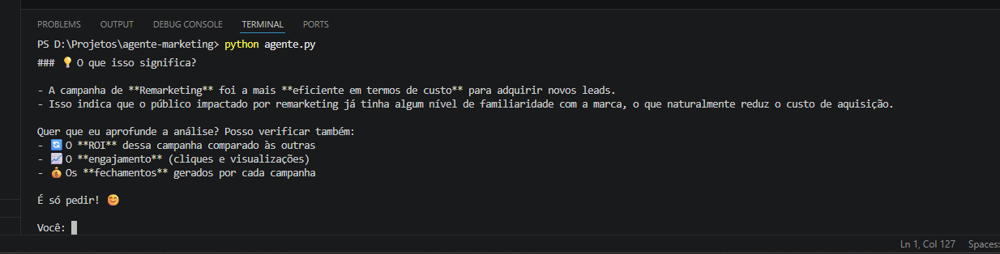
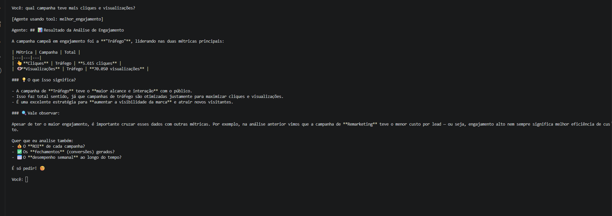
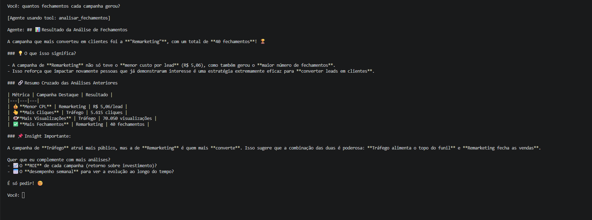
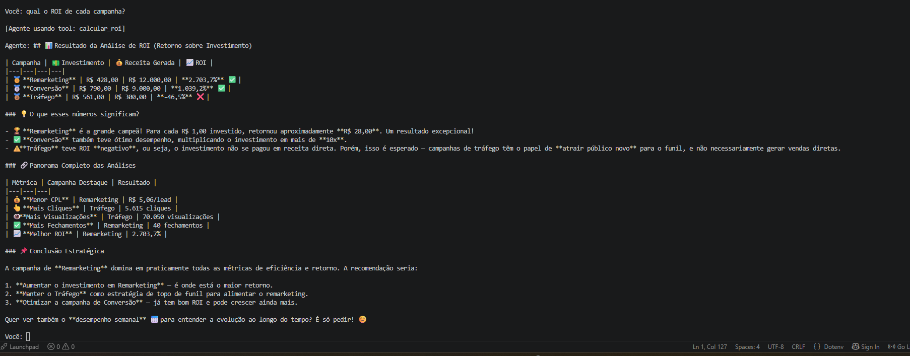
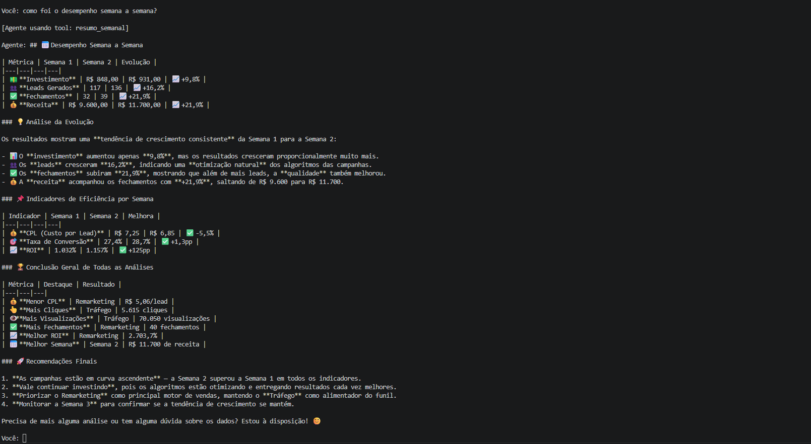
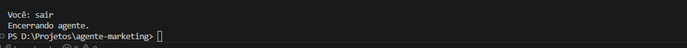

# 🤖 Agente de Marketing com IA

Agente inteligente em Python que analisa dados de campanhas de marketing digital e responde perguntas em linguagem natural usando a API da Anthropic com function calling e Pandas.

## 🎯 O que o agente faz

- Identifica a campanha com menor custo por lead (CPL)
- Analisa engajamento (cliques e visualizações) por campanha
- Contabiliza fechamentos gerados por cada campanha
- Calcula o ROI de cada campanha
- Gera resumo de desempenho semana a semana

## 🛠️ Tecnologias utilizadas

- Python 3
- [Anthropic SDK](https://github.com/anthropics/anthropic-sdk-python) — API de IA com function calling
- Pandas — análise e manipulação de dados CSV
- python-dotenv — gerenciamento de variáveis de ambiente

## 📁 Estrutura do projeto

## ▶️ Como executar

1. Clone o repositório
2. Instale as dependências:
```bash
pip install anthropic pandas python-dotenv
```
3. Crie um arquivo `.env` com sua chave:

4. Execute o agente:
```bash
python agente.py
```

## 💬 Exemplos de perguntas

- `qual campanha teve o menor custo por lead?`
- `qual campanha teve mais cliques e visualizações?`
- `quantos fechamentos cada campanha gerou?`
- `qual o ROI de cada campanha?`
- `como foi o desempenho semana a semana?`

## 📸 Demonstração

### Menor custo por lead


### Engajamento


### Fechamentos


### ROI por campanha


### Desempenho semanal


### Encerrando o agente


## 🧠 O que aprendi construindo este projeto

- **Function calling com a API Anthropic:** entendi como o modelo decide qual ferramenta usar baseado na descrição semântica de cada tool — a qualidade da descrição determina a qualidade da decisão do agente.
- **Separação de responsabilidades:** aprendi a separar o loop do agente (`agente.py`) das funções de análise (`tools.py`), tornando o código organizado e escalável.
- **Pandas na prática:** usei `groupby`, `sum`, `mean`, `idxmin`, `idxmax` e `iterrows` para responder perguntas reais de negócio sobre dados de campanhas.
- **Colunas derivadas:** aprendi a criar métricas que não existem no dado bruto, como `custo_por_lead = investimento / leads`, calculadas dinamicamente dentro da tool.
- **Fluxo de tool_use:** compreendi o ciclo completo — pergunta → modelo decide → Python executa → resultado volta para o modelo → resposta em linguagem natural.

## 👨‍💻 Autor

Arthur Sanches  
[GitHub](https://github.com/ArthurSanches-ds)